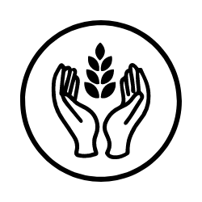

# FoodShare App

FoodShare is a community-driven app that aims to reduce food waste by connecting people who have surplus food with those in need.

## Features

- **Post Food Items:** Users can post details about surplus food items they want to share, including type, description, pickup location, and availability status.

- **Find Food:** Users in need can easily browse and search for available food items in their area.

- **Claim Food:** Interested users can claim available food items and arrange for pickup.

- **Mark as Claimed:** Food posters can mark their items as claimed when they've been picked up.

- **User Authentication:** Secure user registration and authentication using Firebase authentication.

- **User Profiles:** Users can view and update their profiles, including contact information.

## Installation

1. Clone the repository: `git clone https://github.com/andkirsten/food-board.git`
2. Navigate to the project directory: `cd food-board`
3. Install dependencies: `npm install`

## Usage

1. Run the app: `npm start`
2. Access the app in your browser: `http://localhost:3000`

## Technologies Used

- React
- Firebase (Authentication, Firestore, Storage)
- React Router
- React Bootstrap (for styling)
- Google Fonts
